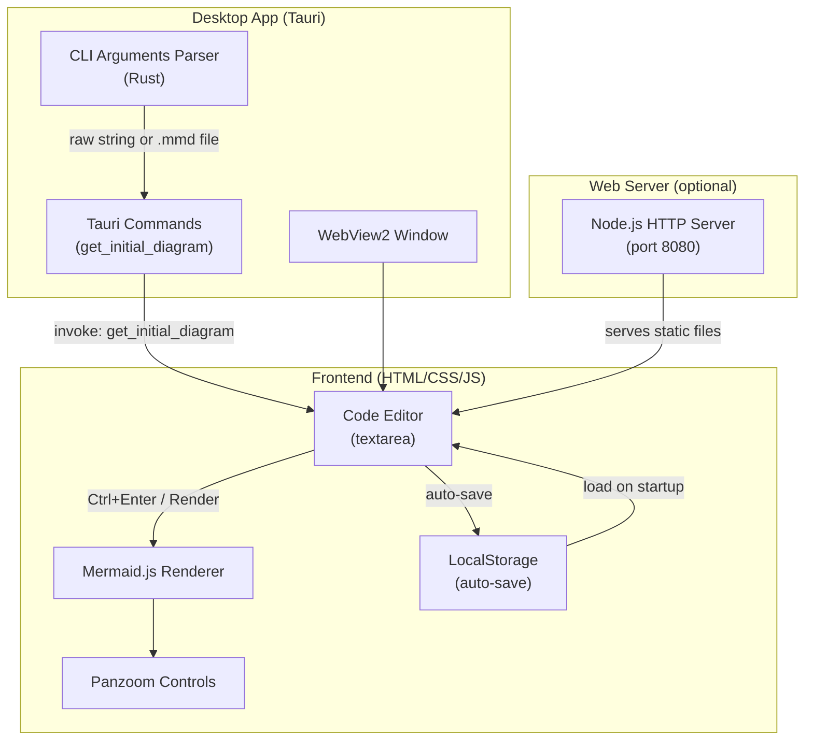

# System Architecture

## Components

- **Tauri Desktop App**: Rust backend wraps the web frontend in a native WebView2 window. Handles CLI argument parsing and passes diagram content to the frontend via Tauri commands.
- **Frontend**: Pure HTML/CSS/JS with mermaid.js for rendering and panzoom for interactive zoom/pan. Works both in browser and inside the Tauri webview.
- **Node.js Server**: Optional lightweight HTTP server for serving the web app in a browser.
